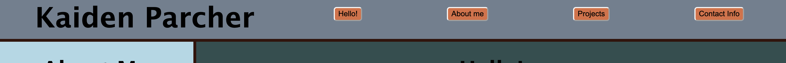
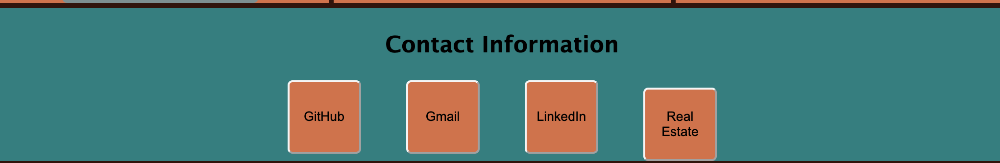

# My Portfolio

## Description 

This Portfolio was created to highlight my talents to potential employers. At the top there is a Nav bar to lead you to the main sections of my page, including About me, Projects, and Contact Info. I built the skeleton of this HTML using a grid, and assigned the grid's particular information. 

Although this portfolio is small and bland, I plan to continually add to it as my skills improve. There will also be a chance to upload many more projects as this class moves along.

Repository URL: https://github.com/Kaidenparcher/my-portfolio
Deployed URl: https://kaidenparcher.github.io/my-portfolio/

## Installation

No installation needed beyond basic web access.

## Usage 

Use Navbar at the top of the page to scroll to particular sections of the application.

Use Contact info buttons to access links to my github and other socials.

## License

This application uses the MIT license
Read guide from GitHub (https://github.com/git/git-scm.com/blob/main/MIT-LICENSE.txt)

## Features

Buttons at top of screen lead to particular sections of the application

Buttons at bottom of screen lead to links

© 2023 edX Boot Camps LLC. Confidential and Proprietary. All Rights Reserved.